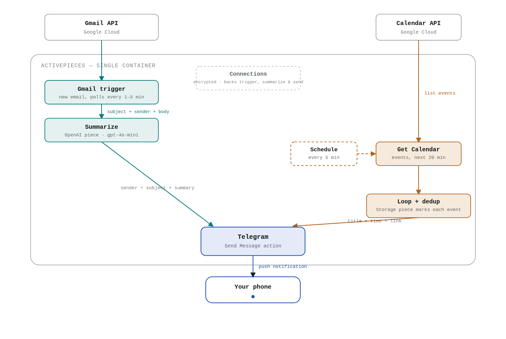
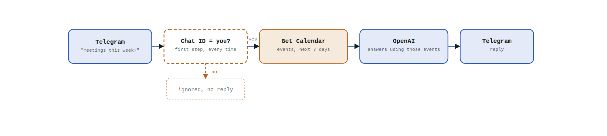

# Personal Assistant

Automation (no app, no server code) that watches Gmail and Google Calendar, summarizes
with OpenAI, and notifies you on Telegram — plus an optional flow that answers questions
on demand. Built on [Activepieces](https://www.activepieces.com), either as a hosted
account (no install, nothing to run) or self-hosted (MIT-licensed, single Docker
container).

## Architecture



| Flow | Trigger | Steps |
|---|---|---|
| **Email** | New unread Gmail | Gmail trigger → OpenAI (summarize) → Code (format + escape) → Telegram send |
| **Meetings** | Every 5 min | Schedule → Get Calendar events (next 20 min) → Loop + Storage dedup → Telegram send |

## Ask on demand (optional)



Message the bot a question ("what meetings do I have this week?") and it replies.
**The chat-ID gate is not optional** — without it, anyone who finds your bot can query
your calendar.

## Stack

| Piece | Used for |
|---|---|
| [Activepieces](https://www.activepieces.com) | Runs all flows — cloud account or self-hosted single container |
| Gmail + Google Calendar (OAuth2, read-only) | Trigger + data source |
| Telegram Bot API | Notifications + the ask-on-demand channel |
| OpenAI (`gpt-4o-mini`) | Email summaries and Q&A answers |

## Setup

Track progress with [`SETUP.md`](SETUP.md) — the same steps below, as a checklist.

1. **Start it** — pick one:
   - **Cloud (no install, no commands)**: sign up at [cloud.activepieces.com](https://cloud.activepieces.com). Free tier covers several active flows, which is all this needs.
   - **Self-hosted (needs a machine where you can run Docker commands)**: `cp .env.example .env && docker compose up -d` → open `localhost:8080`, create your admin account.
2. **Telegram bot**: [@BotFather](https://t.me/BotFather) → `/newbot` → copy the token.
   Message your bot once, then open `https://api.telegram.org/bot<TOKEN>/getUpdates` to
   read your chat id from the JSON.
3. **Google account access**:
   - **Cloud**: skip straight to step 4 — Activepieces Cloud has its own pre-registered
     Google OAuth app, so adding the Gmail/Calendar connections just pops up a normal
     Google sign-in window. No Google Cloud Console needed.
   - **Self-hosted**: you bring your own OAuth client — enable the Gmail API + Calendar
     API in a Google Cloud project, then create an OAuth client using the redirect URI
     Activepieces shows you when you add the connection.
4. **Connections** (Activepieces UI → Connections): add Gmail, Google Calendar, Telegram
   Bot, and OpenAI.
5. **Build the flows** in the visual editor, matching the diagrams above:

   **Email** — 4 steps, in this exact order (order matters — a step can only use data
   from steps *before* it):

   1. **Gmail trigger**: New Email, unread only.
   2. **OpenAI action** (model `gpt-4o-mini`), single "Question" field combining the
      instruction and the trigger's Subject/From/Body:
      ```
      You write a single, concrete one-sentence summary of an email for a push
      notification. State the key fact or ask directly - no greeting, no preamble, no
      quotation marks, no "this email is about".

      Subject: {{subject}}
      From: {{from}}

      {{body}}
      ```
   3. **Code action** — builds the final message and escapes HTML-unsafe characters, so
      raw email content (which can contain anything) never breaks the send step. Inputs:
      `from` and `subject` (Gmail trigger fields), `messageId` (Gmail trigger's Message
      ID), `summary` (the OpenAI step's result):
      ```javascript
      export const code = async (inputs) => {
        const esc = (s) => String(s ?? '')
          .replace(/&/g, '&amp;')
          .replace(/</g, '&lt;')
          .replace(/>/g, '&gt;');

        const gmailLink = inputs.messageId
          ? `https://mail.google.com/mail/u/0/#inbox/${inputs.messageId}`
          : null;

        let message = `📧 <b>New Email</b>\n`;
        message += `<b>From:</b> ${esc(inputs.from)}\n`;
        message += `<b>Subject:</b> ${esc(inputs.subject)}\n\n`;
        message += esc(inputs.summary);
        if (gmailLink) message += `\n\n<a href="${gmailLink}">Open in Gmail</a>`;

        return { message };
      };
      ```
   4. **Telegram send** — Parse Mode **`HTML`**, Message field = *only* the Code step's
      `message` output (a single inserted variable, nothing else typed around it).

   **Why not simpler?** Telegram's `MarkdownV2` parse mode looks tempting for bold text,
   but it requires escaping ~20 reserved characters (`. - ( ) ! ...`) in *any* dynamic
   text — and email subjects/bodies can contain literally anything, so it breaks
   constantly. `HTML` mode only reserves `& < >`, which the Code step escapes safely.
   Skipping the Code step and building the message directly in the Telegram field works
   too, but then you're back to plain, unformatted text with no safe way to add bold or
   a link.

   **Meetings** — Schedule (5 min) → Get Calendar events (next 20 min) → Loop over
   events → inside the loop: Storage *Get*(event id) → skip if already set → Telegram
   send → Storage *Put*(event id, true).

   **Ask** (optional) — Telegram trigger (new message) → condition: chat id == yours,
   else stop → Get Calendar events (next 7 days) → OpenAI answers the incoming message
   using those events → Telegram reply.

6. Turn the flows **On**. Test: email yourself, create an event ~12 min out, message
   the bot.

## Notes

- Secrets (OAuth tokens, bot token, API key) live only in Activepieces' encrypted
  Connections store — never in `.env` or git. On the cloud plan that store is hosted by
  Activepieces; self-hosted, it's in your own `activepieces_data` Docker volume.
- Meeting source is Google Calendar, not the Zoom API directly — covers most Zoom
  invites since they carry a join link as a calendar event. Swap in a direct Zoom API
  call if some of yours don't land on your calendar.
- The Ask flow answers from a fixed 7-day window, not a real search — fine for "what's
  coming up," not for searching further back.
